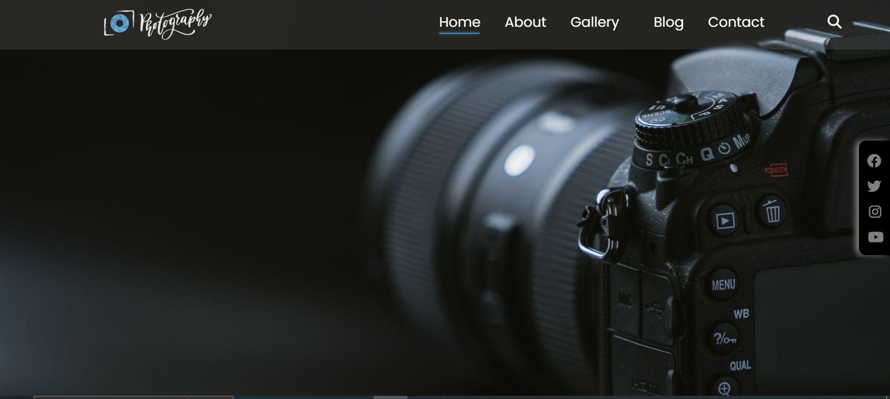

# Photography Page

## Description

The Photography Page project is a visually stunning HTML and CSS website designed to showcase your photography skills. It incorporates a captivating dark theme for an enhanced viewing experience and is fully responsive, ensuring your photography looks great on all devices.

## Features

- **Responsive Design**: The website adapts seamlessly to different screen sizes, from desktops to smartphones.

- **Dark Theme**: A beautiful dark theme adds a touch of elegance to your photography, making it stand out.

- **Striking Layout**: The layout is meticulously designed to display your photography in an organized and visually appealing manner.

- **Easy Navigation**: The project includes an intuitive navigation menu, making it easy for visitors to explore your photography collections.

- **Image Galleries**: Showcase different image galleries or categories, allowing you to organize your photography content effectively.